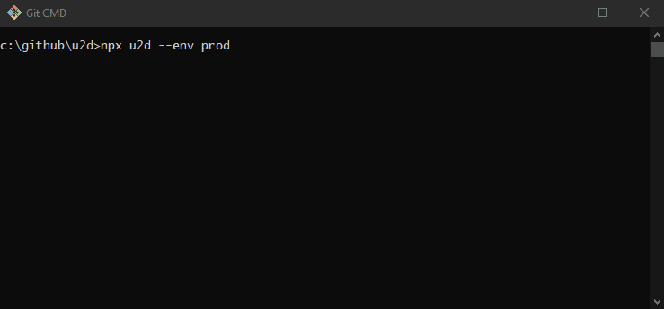
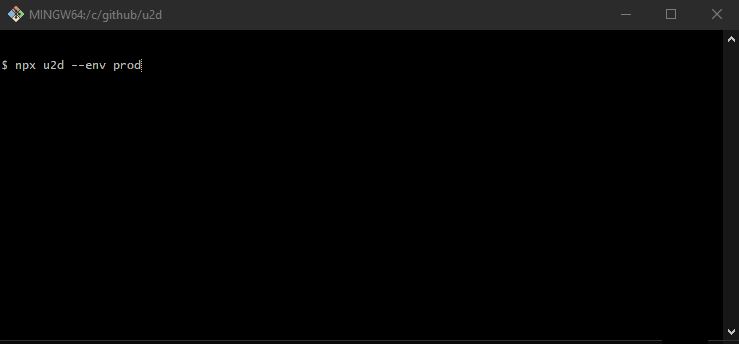

# U2D

`u2d` › up to date

| tty                                    | non-tty                                        |
|----------------------------------------|------------------------------------------------|
|  |  |

A developer experience tool to enforce [environment](#engine-checks) and [dependency](#package-checks)
version policies.

- Want all of your projects to use the same `node` and `npm` semver range?
- Same `react` major version?
- How about detecting duplicate packages in a project's `node_modules`?
- Or even making sure certain dependencies are never installed?

Use `u2d` anywhere in your projects lifecycle to get instant feedback to protect releasing code integrating with
unsupported versions. Have several projects and want a single configuration? Host your configuration remotely on your
own CDN, or use something like https://jsonbin.io/.

## TOC

- [Install](#install)
- [CLI](#cli)
    - [Options](#cli-options)
- [Node](#node)
    - [Options](#node-options)
- [Checks](#checks)
    - [Engines](#engine-checks)
    - [Packages](#package-checks)
- [Config](#config)
- [Environment](#environment)
- [Manager](#manager)
- [Level](#level)

## Install

```shell
$ npm i -D u2d
```

## CLI

The `u2d` CLI was built to be quick and simple, allowing developers to run it anywhere at any step in the development
process.

In a terminal

```shell
$ npx u2d 
```

Or as an `npm script`

```json
{
  "scripts": {
    "prepare": "u2d"
  }
}
```

### CLI Options

| flag                  | description                                        | type                             | default         |
|-----------------------|----------------------------------------------------|----------------------------------|-----------------|
| `-p \| --cwd`         | working directory                                  | `string`                         | `process.cwd()` |
| `-c \| --config`      | configuration file or url                          | `string`                         | auto detected   |
| `-m \| --manager`     | package [manager](#manager)                        | `npm \| pnpm \| yarn`            | auto detected   |
| `-d \| --depth`       | package `node_modules` depth                       | `Infinity \| number`             | `Infinity`      |
| `-e \| --env`         | package `node_modules` [environment](#environment) | `local \| dev \| prod \| global` | `local`         |
| `-l \| --log`         | logging [level](#level)                            | `error \| warn \| info \| debug` | `info`          |
| `-a \| --local`       | enable `package.json` engines/dependencies         |                                  |                 |
| `-b \| --bail`        | disable error collection                           |                                  |                 |
| `-s \| --silent`      | disable logging                                    |                                  |                 |
| `-o \| --show-config` | print config and exit                              |                                  |                 |
| `-h, --help`          | display help                                       |                                  |                 |

You can also run `npx u2d --help` locally

## Node

You can directly import `u2d` in your node projects too. Useful for injecting into scripts or actions, allowing you to
manually handle results.

```js
// Supports ESM
import u2d from 'u2d';
// and CJS
const u2d = require('u2d').default;

u2d({ /* options */ }).then(({ skips, infos, errors, warnings }) => {
  if (errors.length) {
    process.exit(1);
  }
});
```

### Node Options

| name      | description                                        | type                             | default         |
|-----------|----------------------------------------------------|----------------------------------|-----------------|
| `cwd`     | working directory                                  | `string`                         | `process.cwd()` |
| `config`  | configuration file or url                          | `string \| object`               | auto detected   |
| `manager` | package [manager](#manager)                        | `npm \| pnpm \| yarn`            | auto detected   |
| `depth`   | package `node_modules` depth                       | `Infinity \| number`             | `Infinity`      |
| `env`     | package `node_modules` [environment](#environment) | `local \| dev \| prod \| global` | `local`         |
| `log`     | logging [level](#level)                            | `error \| warn \| info \| debug` | `info`          |
| `local`   | enable `package.json` engines/dependencies         | `boolean`                        | `false`         |
| `bail`    | disable error collection                           | `boolean`                        | `false`         |

## Checks

A check is a semver range to run against an found version. A check must define a `pass` range, and optionally a
`fail` range and/or a `help` description.

Example `node` check, will pass on 16+, warn on 14-15, and fail on <12.

```json
{
  "engines": {
    "node": {
      "pass": ">=16",
      "fail": "<12",
      "help": "https://letmegooglethat.com/?q=update+node"
    }
  }
}
```

Checks can also be expressed using shorthand

| input                | output                 | description                            |
|----------------------|------------------------|----------------------------------------|
| `true`               | `{ pass: '*' }`        | always pass, use to override config    |
| `false`              | `{ pass: '<*' }`       | always fail, use to error if installed |
| `string`             | `{ pass: string }`     | provide pass                           | 
| `number`             | `{ pass: '^number' }`  | provide pass, with caret               |
| `[pass, fail]`       | `{ pass, fail }`       | provide pass and fail                  |
| `[pass, true]`       | `{ pass, fail: '*' }`  | provide pass, use to require           |
| `[pass, fail, help]` | `{ pass, fail, help }` | provide pass, fail and help            |

### Engine Checks

These checks are explicit, as it will check the [environment](#environment) of the `cwd`.

- `node`
- `npm`
- `pnpm`
- `yarn`

### Package Checks

Currently only supporting `npm`, `u2d` will check the installed packages based on the [env](#environment) and
specified `depth`.

## Config

By default, `u2d` doesn't do much without some configuration. You can use your local `package.json` as a starting point,
by enabling the `local` option. Simply add one of the files below, or define your own and provide using a `config`
option.

- `u2d` property in `package.json`
- `.u2drc` JSON file
- `.u2d` with `.json | .js | .cjs` extension
- `u2d.config` with `.js | .cjs` extension

This configuration can live locally, or externally; we suggest both! Hosting externally enables multiple projects to use
a single source of configuration. Here's an [example](https://api.jsonbin.io/v3/b/628e7498402a5b38020d5cb1) hosted at
https://jsonbin.io/. Hosting locally allows individual projects to add project specific configuration and/or override
external policies.

The result can expose any [node option](#node-options), with the addition of the following

| name       | description                          | type                       |
|------------|--------------------------------------|----------------------------|
| `extends`  | configuration file                   | `string`                   |
| `engines`  | [environment checks](#engine-checks) | `{ [key: string]: Check }` |
| `packages` | [dependency checks](#package-checks) | `{ [key: string]: Check }` |

Example

```js
module.exports = {
  extends: 'https://api.jsonbin.io/v3/b/628e7498402a5b38020d5cb1', // A basic example
  local: true, // Use `package.json` engines/dependencies
  engines: {
    node: 16, // Warn if not on node@^16
    npm: '7 - 8' // Warn if not npm@>=7 <9
  },
  packages: {
    'left-pad': false, // Error if installed
    'lodash': [4, true], // Error if not on lodash@^4
    'react': true // Allow any version
  }
}
```

## Environment

The `env` config refers to the type of dependencies to run [package checks](#package-checks) against. By default, `u2d` uses
`local` to check your `cwd` for matching `node_modules` packages.

```typescript
export const Environment = {
  GLOBAL: 'global',
  LOCAL: 'local',
  PROD: 'prod',
  DEV: 'dev'
} as const;
```

| env      | description                                                     |
|----------|-----------------------------------------------------------------|
| `global` | Check all `node_modules` packages in the global install prefix  |
| `local`  | Check all `node_modules` packages in the `cwd`                  |
| `prod`   | Check only non-development `node_modules` packages in the `cwd` |
| `dev`    | Check only development `node_modules` packages in the `cwd`     |

## Manager

Currently, `u2d` only supports `npm` but recognizes the value in handling multiple project management solutions. This
limitation only applies to [package checks](#package-checks).

```typescript
export const Manager = {
  NPM: 'npm',
  PNPM: 'pnpm',
  YARN: 'yarn'
} as const;
```

| manager | description            |
|---------|------------------------|
| `npm`   | https://www.npmjs.com/ |
| `pnpm`  | https://pnpm.io/       |
| `yarn`  | https://yarnpkg.com/   |

## Level

By default `u2d` uses the `info` log level to communicate what was processed to give developers critical information
about the executed checks. The level also applies to capturing results when using the [node export](#node).

```typescript
export enum Level {
  error = 0,
  warn = 1,
  info = 2,
  debug = 3
}
```

| level   | description                                  |
|---------|----------------------------------------------|
| `error` | Capture only exceptions and/or failed checks |
| `warn`  | Capture non-pass checks, and errors          |
| `info`  | Capture pass checks, warnings and errors     |
| `debug` | Capture everything, including skips          |

## License

`u2d` is [MIT licensed](./LICENSE)
